# healthcare-server
A rubyOnRails based web application with a small concept behind healthcare full proposal here [Proposal](https://github.com/rajagopal28/healthcare-server/blob/master/proposal.md)
The related mobile repository can be viewed ==> [Mobile](https://github.com/rajagopal28/Jackie)
## Problem at hand
Our major objective is to create an environment that helps us be independent and be healthy. Being independent makes us feel empowered all the time. People tend to forget things more often. But when it comes to health we got to be vigilant. Diabetic people need constant attention and care when it comes to health checks and medications. Level-2 Diabetes often required periodic insulin intake to keep glucose level balanced. They should also maintain a timely and proper diet that goes hand in hand with their medication schedules. We live in a busy world where we cannot be around all the time. With that being said we can deep dive into our proposed solution.

## The proposed solution
The proposed solution is to have a multi-platform environment that helps you take care of yourself. We intend to build a personal assistant based ecosystem that helps you keep track of your health by monitoring your body vitals viz., glucose, pressure, pulse and temperature, perform tasks like book appointments, view or remind you about your booked appointments, keep track of you medicine prescriptions, intake and personal medicine inventory management in a more nurturing and enjoyable way.

## Proposed architecture

This entire application has 3 essential components
- The centralized healthcare server which holds patient data such as vital information, medicine intake logs, appointments, prescriptions etc.
- The mobile app + wearable component - with this combo we can collect user information such as vitals, medicine intake activities, reminders on appointments and medicine intakes etc.
- The Alexa skill - which is essentially coupled with the data back-end to personally serve people in managing their vitals, appointments and medicine intake.

## Backend Schema

## Major User cases
Centralized web applications with ability too
- view & create doctor appointments
- view & create vitals
- monitor and visualize vitals
- view & create medicines
- view & create prescriptions and medicines
- view & create doctor appointments, schedules and reschedules
- view & create notifications for doctors
- monitor and visualize medicine availability

## Technical Nuances
As we wanted to have to quick backend setup so that we can have some time available to spent on the new technologies that are involved in the component(viz., react native, android, alexa and Aurdino devlopment) we chose Ruby On Rails and it was totally worth it.
* **Ruby on Rails** is one of the beautiful script based web frameworks, it did all the data management work setup for us with it's scaffolding generation, what a beauty. Just defining the attributes in `` rails generate scaffolding `` command generates everything to manage that particular model, it even gives rest end points in an instant. We were totally carried away by it capability to create a robust and flexible back-end in a short span.
* **Postgres** is one of the most advanced open source database management system that is as is. We chose rails as we structured the data in a most relational way. Postgres supported quick setup and easy to manage data and their relationship. Of course, rails and it's migrations have a great part as the out of the box postgres support elevated everything to a different level.
* **Pure CSS** is the best light weight css framework that helped us create a pretty decent looking UI views. Their approach was so simplistic that they provide on demand inclusions of styles that can be included only when needed say forms, grids and layouts , such that the site does not become heavy with elements that will not be used.
* **Chartkick + highcharts** made us drop our jaws because it is the first ever server side chart rendering framework. It was really smooth as if we are using server side tag libraries to loop through list of data. Credits to rails of cource, gems for everything that we need, really helped us save time. We used some server side capabilities to conditionally choose charts and render data in a synchronous way, really first time we have used a chart library that did not use ajax and rest call.
* **Heroku** was our first choice as it is well known for its intensive support for rails applications. Its of the box support to postgres as an out of the box add-on made us feel re-assured with our choice on postgres as our database.
* **GCM server side support** was required as part of the mobile application concept. With an additional inclusion of server side capabilities in capabilities to call external APIs such as RestClient gem helped us big time to integrate this feature in a seamless way.

## Major User Flows:
### Home:
This is the simplistic Home UI in PureCSS with nav and everything. I know it looks kind of childish with the images we have chosen but our features are realtime and helpful.
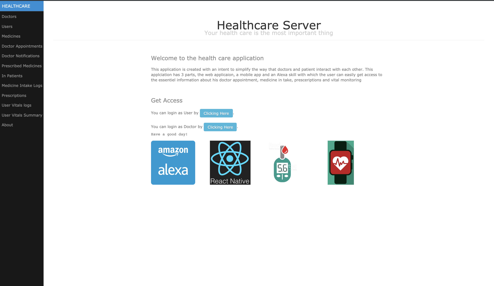
### Users:
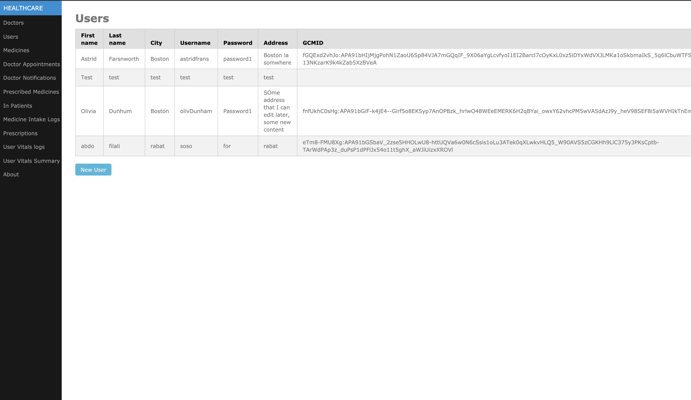
### Doctors:
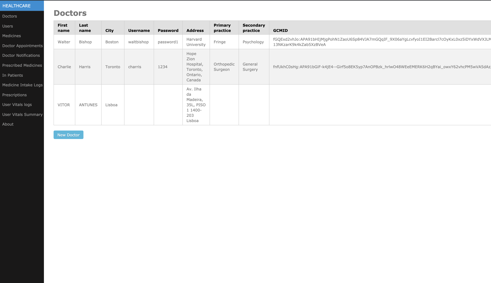
### Doctor Appointments:
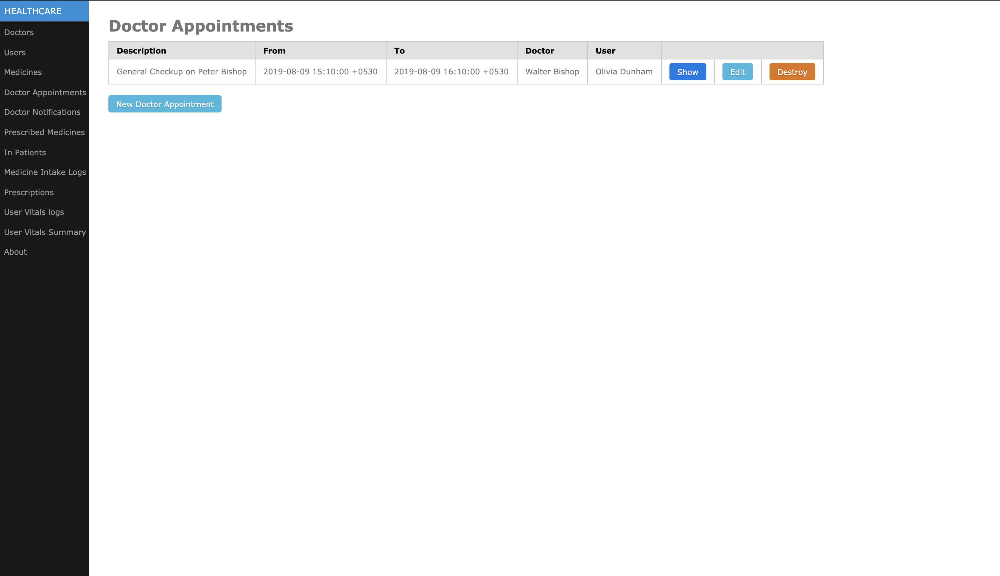
### Doctors Notifications:
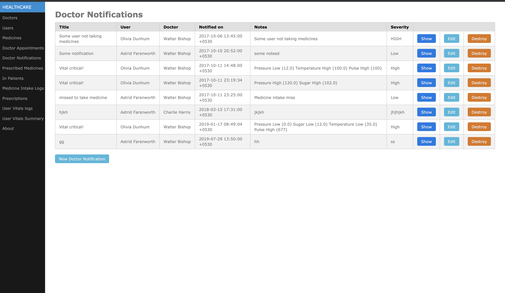
##New doctor appointments
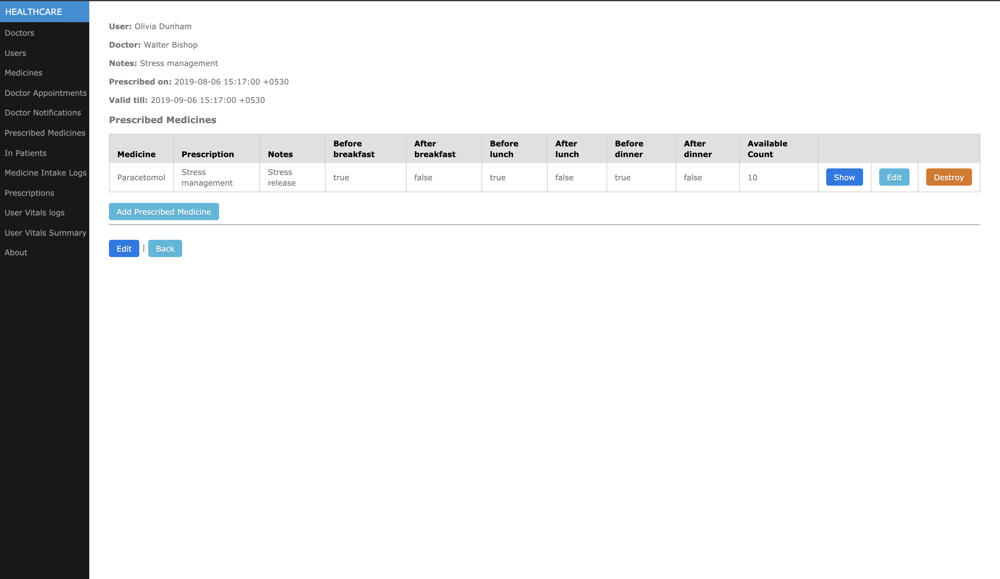
### Medicines:
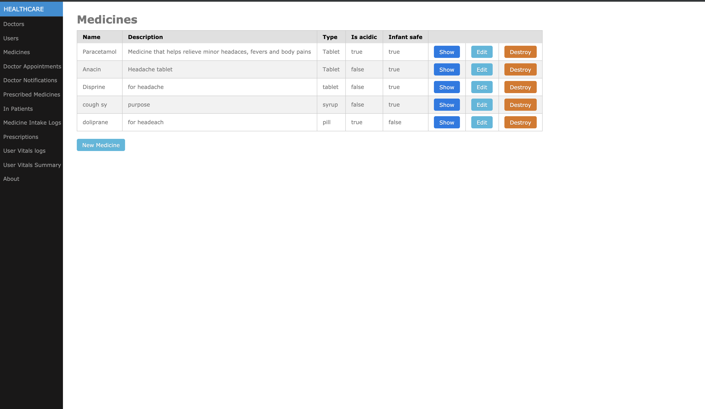
### Prescribed Medicines:
Prescribed Medicines for user
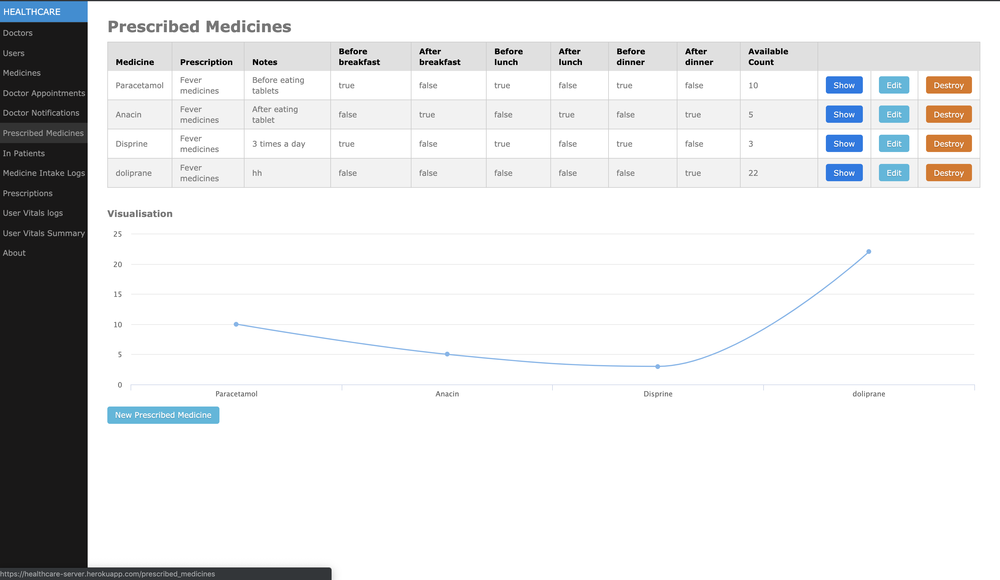
Prescribed medicines edit view
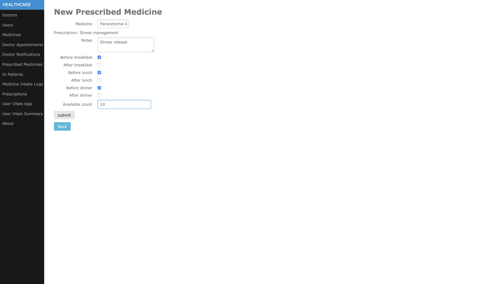
### In Patients:

### Medicine intake logs:
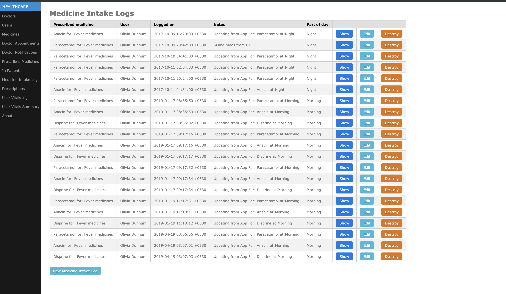
Medicine intake logs deletion view
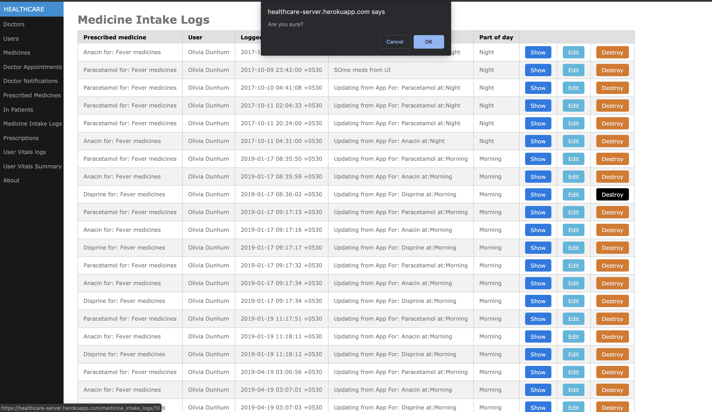
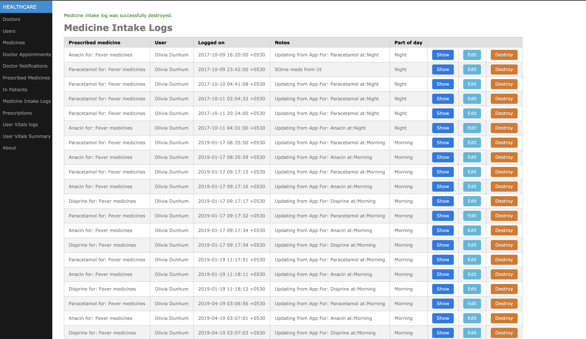
### Prescriptions:
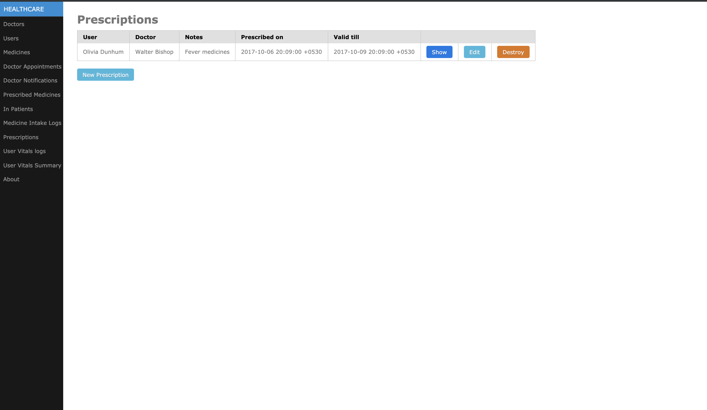
### User Vital logs:
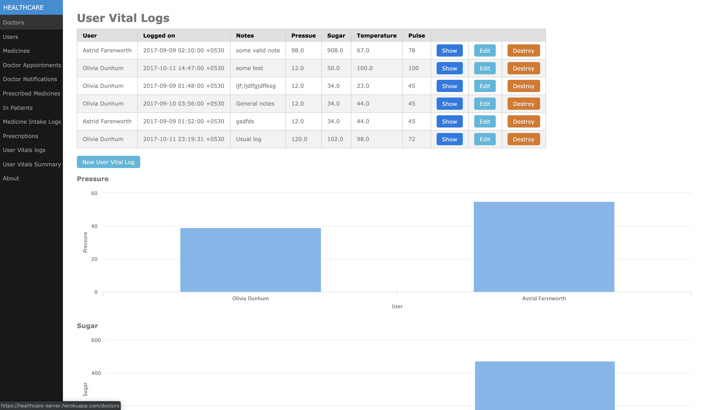
User Vital logs with user wise grouping

### User vitals summary:
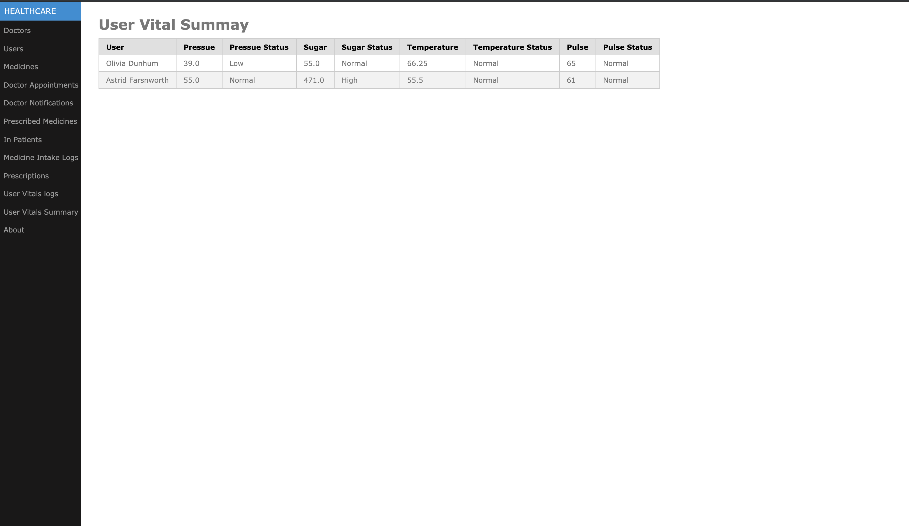

## Key Learnings
- How to create and publish an alexa skill by leveraging the voice activated technlogies in a smooth and effective way.
- React native is adaptive, flexible enough to let both native as well as hybrid code and features by binding them together with their coherant data flows and models.
- Ruby on rails is the quickest script based web application framework that can be developer friendly as well as feature friendly with their ability to scale and balance.

## References
- http://guides.rubyonrails.org/association_basics.html
- https://stackoverflow.com/questions/36946498/for-loop-with-select-helper
- https://www.tutorialspoint.com/ruby-on-rails/rails-scaffolding.htm
- https://www.digitalocean.com/community/tutorials/how-to-use-postgresql-with-your-ruby-on-rails-application-on-ubuntu-14-04
- http://mentalized.net/journal/2017/04/22/run-rails-migrations-on-heroku-deploy/
- https://www.chartkick.com/
- http://guides.rubyonrails.org/active_record_querying.html
- https://www.theodinproject.com/courses/ruby-on-rails/lessons/sessions-cookies-and-authentication
