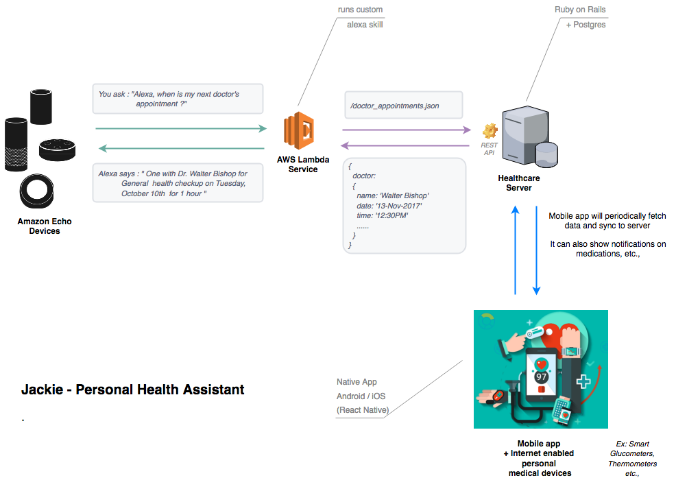
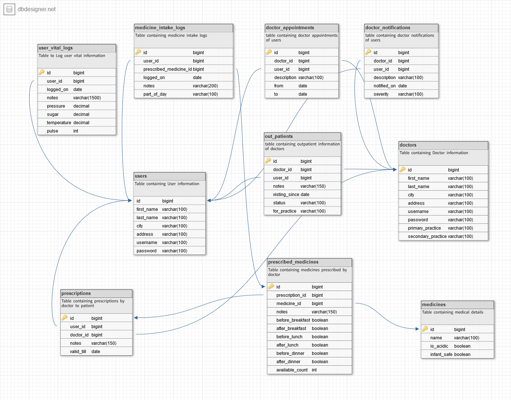
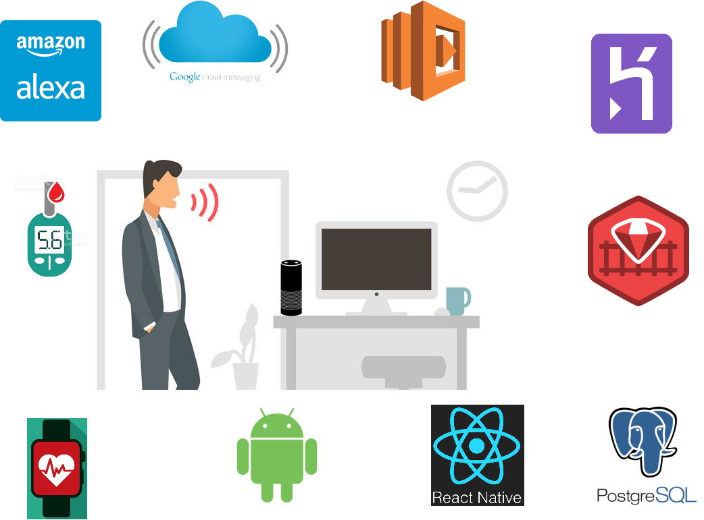

## Inspiration
Diabetes is one of the vicious diseases of the millennia.  Statistics say that one in every 10 adults is diabetic and 90% of them have level-2 diabetes. People with diabetes need constant care from people around them, proper health assessments and treatments on time. Level-2 diabetes makes it more crucial as the fluctuating insulin levels have an adverse effect, both physically and mentally. People with Diabetes suffer from obesity, anxiety, sleeplessness and palpitation if they are not on proper medication and care. They also need a regular dosage of insulin to keep their sugar level balanced to avoid dizziness and kidney problems.

With a deep care for people with diabetes, we propose a multi-platform system that will help them to independently take care of their health, to the maximum extent possible. We also believe human empathy can never be replaced hence we do not intend to solve anything that needs human's love and care. We name this system Jackie based on the character Jackie Peyton portrayed by Edie Falco in the renowned TV series, Nurse Jackie. We chose this character because Jackie is witty that she gets things done by knowing her patients really well. She'll be rude when need to be and caring when required.

The primary problem statement is to create an environment that helps us be independent and be healthy.

## Problem at hand
Our major objective is to create an environment that helps us be independent and be healthy. Being independent makes us feel empowered all the time. People tend to forget things more often. But when it comes to health we got to be vigilant. Diabetic people need constant attention and care when it comes to health checks and medications. Level-2 Diabetes often required periodic insulin intake to keep glucose level balanced. They should also maintain a timely and proper diet that goes hand in hand with their medication schedules. We live in a busy world where we cannot be around all the time. With that being said we can deep dive into our proposed solution.

## The proposed solution
The proposed solution is to have a multi-platform environment that helps you take care of yourself. We intend to build a personal assistant based ecosystem that helps you keep track of your health by monitoring your body vitals viz., glucose, pressure, pulse and temperature, perform tasks like book appointments, view or remind you about your booked appointments, keep track of you medicine prescriptions, intake and personal medicine inventory management in a more nurturing and enjoyable way.
Following are features or capabilities that we are proposing as part of this system and we have even tried to implement some of them in the short time.

* Reminders about insulin and periodic sugar level check through voice response and notifications.
* check and record body vitals such as pressure, sugar, pulse thorough digitally connected digital measuring devices such as a glucometer, thermometer.
* keep track of personal medical records, centralized access across devices
* Book doctor appointment automatically based on user preference or machine learning on user activity pattern or on voice commands
    * Possibility to leverage existing health care platforms such as Practo and their APIs.
* Send periodic updates of user activities to the doctor preferred, such as medicine intake miss, vital elevations etc
    * Try finding the usual doctors, if not find similar department doctor who is the nearest to current location
* Manage prescriptions and personal medicine inventory
    * order medicines with the scanned images etc
    * order online from services that deliver medicines based on the scanned prescriptions
* Monitor your body vitals - pressure, pulse and alert doctors and family using emergency notification system through automated call, SMS, emails etc with live user location information
* Image processing - take picture of the food to know the amount of sugar, carbohydrate, protein, fat etc
* Emergency alerts to doctors and desired contacts on certain threshold violations or missing the medication or eating too much sugar and so on
* Advice, tips and tricks from on-line resources to lead a healthy life
* Enabling users to perform physical activities to keep them away from the major diabetes symptom, obesity.
* Manage health insurance subscriptions, renewals and apply claims for the treatment taken.
* Gamifying incentives for good habits that are followed, keeping positive medicine intake patterns, food habits, physical exercises and so on
* Socializing with fellow users based on user patterns/behaviours in general and from those who follow similar habits.
* Most of these features are data-driven and can be made to evolve with major Machine Learning and Data Analysis techniques

## Proposed architecture

This entire application has 3 essential components
- The centralized healthcare server which holds patient data such as vital information, medicine intake logs, appointments, prescriptions etc.
- The mobile app + wearable component - with this combo we can collect user information such as vitals, medicine intake activities, reminders on appointments and medicine intakes etc.
- The Alexa skill - which is essentially coupled with the data back-end to personally serve people in managing their vitals, appointments and medicine intake.

## Backend Schema

## Full Disclosure
We had a tiring long plan but we had only limited amount of time as we came to know about this opportunity at a later point in time. We have to build a prototype to demonstrate some of the features mentioned. We have not integrated with a wearable and with vital readable devices as we did not have enough time and resources. We had added all the possible features that we are targeting in the near and far future in the "What's next for Jackie" section. We will be in a stage to demo the complete prototype when we present the application in New York.

## What we built in the given time
We have built this application with group of tech that comes to aid people with level-2 diabetes
- Personalized voice assistant with the help of Alexa that helps you not miss anything that makes you better every day.
    - Book doctor appointments
    - Know about upcoming appointments
    - Reminders about medicine intake
    - Alerts on elevated vital levels
- Mobile application
    - That notifies you about medicine inventory alerts
    - That notifies you about upcoming appointments
    - That keeps track of your vitals
    - That notifies doctors when vital levels are abnormal
- Centralized web applications with ability too
    - view & create doctor appointments
    - view & create vitals
    - monitor and visualize vitals
    - view & create medicines
    - view & create prescriptions and medicines
    - view & create doctor appointments, schedules and reschedules
    - view & create notifications for doctors
    - monitor and visualize medicine availability

## How we built it
- As we had to kick start with an application in a short time we chose Ruby on rails + Postgres back-end to give us a quick and stable back-end powered by Heroku infrastructure.
- We spent a considerable amount of time in Alexa as we were totally new to this robust and remarkable voice-activated technology.
- The mobile application we built in React Native also took a considerable amount of effort as it significantly tried to mimic real-world interactions by being close to the users in all their activities.
- We also spend a considerable amount of time in trying to buy a wearable that can quickly help us achieve the data tracking part of the application but lack of time hit us there as well.
- We also have a setup to build IoT capabilities for the vital recording devices such as a glucometer. We have some start but it is not so mature enough to integrate as we are a novice in electronics and micro-controller integration as well.

## Accomplishments that we're proud of
- We feel significantly proud in doing this project in a short time with a great objective to help the diabetic people in need.
- Even though we have not done everything we have planned, we are proud of whatever we have successfully implemented in the short span of time we had.
- The Alexa Skill that we have created is on the verge of getting published.
- The robust, fast running web application server that can be integrated with any device/platform or healthcare application interfaces in a fast reliable way.
- Quick and crips mobile application with an all new framework we have not worked on in a really short span of time.

## What we learned
- Philosophically
	- Time is key, with proper management of time we have effectively utilize all resources available.
- Humanly
	- People with Diabetes suffer more than we actually see outside. We have learned this as soon as we started researching about the problems that are being faced by people with diabetes and the relavent statistics.
- Technically we have learned
	- How to create and publish an alexa skill by leveraging the voice activated technlogies in a smooth and effective way.
	- React native is adaptive, flexible enough to let both native as well as hybrid code and features by binding them together with their coherant data flows and models.
	- Ruby on rails is the quickest script based web application framework that can be developer friendly as well as feature friendly with their ability to scale and balance.

## What's next for Jackie
- We have considerable spill over in the actual proposed system and our primary focus will be to get those done
- IoT integration
    - Various scaling and measuring devices like Weigh scale, Thermometer
- Integrating with Wearable and track user motions to recognise medicine intake, using gesture recognition technologies that are supported
- Adding more capabilities to Alexa skill
- Making mobile application user-friendly
    - Integrating navigation and routing based on geolocation
    - Sharing habits, tips across their social network
- Machine learning capabilities
    - based on the medicine intake, habits and activities we can do pattern analysis and send this analysis to doctors so that they can share it across their patients to make their life better

## References
- IoT:
	- Connected Glucometer: https://www.youtube.com/watch?v=4RYH3Iludy0
	- https://electronics.stackexchange.com/questions/4335/reading-data-from-a-glucose-meter
	- Existing implementation: https://hackaday.io/project/11719-open-source-arduino-blood-glucose-meter-shield
- Problem base:
	- http://www.healthcareitnews.com/news/medtronic-introduces-ibm-watson-powered-sugariq-diabetes-app
	- http://www.who.int/bulletin/volumes/89/2/11-040211/en/
	- https://www.statnews.com/2016/10/11/diabetes-technology/
	- https://www.ncbi.nlm.nih.gov/pmc/articles/PMC2771488/
- Wearable:
	- http://www.todaysmedicaldevelopments.com/article/medical-device-wearable-tec
hnology-manufacturing-42817/
